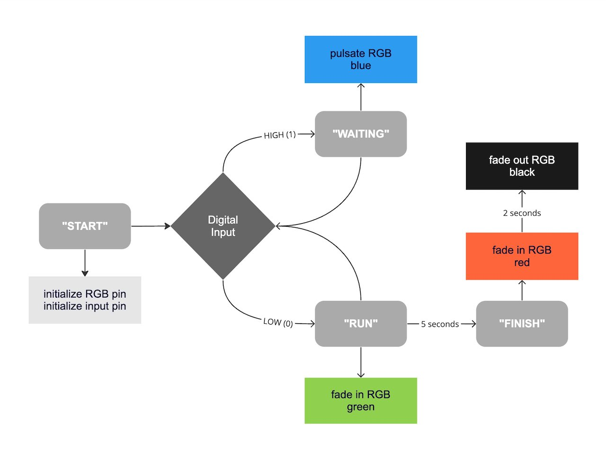

## Assignment #1 Documentation Template  
  
Each assignment/project we complete in this class should be documented in your own 
GitHub repository.  I recommend that you organize your project files into 
separate folders and include a `README.md` file for each one.  This file will be 
your documentation, written in text-based *Markdown* format (.md)  
  
Plese review the (GitHub Markdown Tutorial)[https://docs.github.com/en/get-started/writing-on-github/getting-started-with-writing-and-formatting-on-github/basic-writing-and-formatting-syntax] 
to learn how to on how to use it. Below is the recommended structure for your documentation. 
You can check the (raw version)[../assignment01/raw/refs/heads/main/assignment01/README.md] 
to see its Markdown format.  

### Introduction

Provide a description of your initial project idea and include images of 
the concept sketches that you created in Part 1 of this assignment.  

### State Diagram

Explain the interactive behaviors of the prototype you created and include a 
state diagram (flowchart) to represent it.  For example, below is an example 
state diagram included in the assignment description:  

